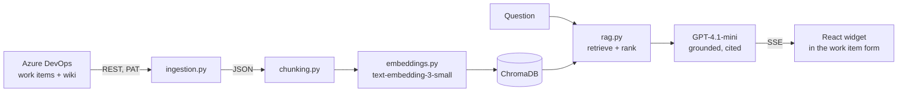

# DevOps Pilot

An AI assistant that lives inside the Azure DevOps work item form. Open a ticket, ask a question, get an answer grounded in your project's own work items and wiki — with citations, streamed token by token.

<!-- Add once the extension is installed in your org: docs/screenshot-panel.png -->

## The problem

Context for a single work item is scattered across five tabs: the ticket, its comments, linked items, the wiki page that explains the subsystem, the pull request that touched it. Answering "why is this blocked?" means opening all of them.

This pulls that context into one grounded answer, without leaving the work item.

## How it works



Three stages, each writing to disk so the next one re-runs without hitting the API again:

```bash
python ingestion.py       # pull work items + wiki  -> data/*.json
python index_corpus.py    # chunk, embed, store     -> ChromaDB
python main.py "why is the auth work blocked?"
```

Then the server the widget talks to:

```bash
uvicorn server:app --reload
```

### Retrieval

The question is embedded with the same model as the corpus, ChromaDB returns the closest chunks, and a ranking pass cuts them to a fixed budget before they reach the prompt. Retrieval is deliberately wider than the prompt budget — eight candidates retrieved, five sent — so ranking has something to choose from.

When the widget sends the id of the work item you have open, that item's chunk is **pinned** into the context even when it isn't the closest vector match, because the question is usually about the thing on your screen. It is pinned rather than filtered on: hard-filtering to one work item would cut the wiki out of every answer, which is the whole point of the tool.

### Grounding

The system prompt permits answers only from the supplied context and requires a source label on every claim. Asked something the corpus does not cover, it says so instead of inventing an answer:

```
$ python main.py "what is the company holiday policy?"
The context provided does not contain information about the company holiday policy.
```

## Design decisions

**Deterministic chunk ids.** Every chunk's id is `{source_type}:{source_id}:{n}`, so re-indexing after an edit overwrites the old vector instead of leaving a stale copy behind to be retrieved alongside the new one. Running `index_corpus.py` twice leaves 21 vectors, not 42.

**Ranking is a pure function.** `select_chunks` takes results and returns results — no I/O — so tie-breaking, empty result sets and budget enforcement are directly testable. Ties break on chunk id, so the same question produces the same context every time.

**Token cost is logged per call.** Every chat and embedding call appends prompt and completion token counts to `data/usage.jsonl`, kept separate so prompt cost is trackable on its own.

**Streaming does not lose its usage data.** The OpenAI streaming API reports no token usage unless `stream_options={"include_usage": True}` is passed, and the usage arrives in a final chunk carrying no content. Miss either detail and every streamed call logs nulls.

**The endpoint is authenticated.** The widget sends the token from `SDK.getAccessToken()`; the backend validates it against the Azure DevOps profile API. Without this, anything that can reach the port can spend the Azure OpenAI key. Requests are rate limited to 20 per minute per user, because a frontend retry loop against a streaming endpoint runs up real cost quickly.

**The widget reads SSE by hand.** `EventSource` cannot set an `Authorization` header, so the stream is consumed through `fetch` and a `ReadableStream` reader, buffering across reads — a network chunk can end mid-frame, and splitting naively drops tokens.

## Things the real data taught us

Both of these were found by running against a live project, not by reading docs:

- **Azure DevOps answers an invalid token with HTTP 203 and an HTML sign-in page**, not 401. Since 203 passes `response.ok`, naive validation parses HTML as JSON and crashes instead of rejecting the caller. `auth.py` demands status 200 *and* a JSON content type.
- **The seeded wiki held every page twice**, once under a dashed path and once under a spaced one, with byte-identical content. Indexing both returns the same page twice for every query, so ingestion deduplicates by content hash.

## Stack

| Layer | Choice |
|---|---|
| Retrieval | ChromaDB, cosine, one collection |
| Embeddings | Azure OpenAI `text-embedding-3-small`, 1536 dims |
| Generation | Azure OpenAI `gpt-4.1-mini`, streamed |
| API | FastAPI, server-sent events |
| Widget | React + TypeScript, Azure DevOps Extension SDK 5, Vite |

Azure OpenAI is reached through its **v1 endpoint** with the plain `OpenAI` client and a `base_url` — not the `AzureOpenAI` class, and with no `api_version`, which that endpoint rejects.

## Running it

```bash
python -m venv .venv && source .venv/bin/activate
pip install -r requirements.txt
cp .env.example .env      # fill in Azure OpenAI + Azure DevOps values

python ingestion.py
python index_corpus.py
python main.py "what is blocking the auth work?"
```

The extension:

```bash
cd extension
npm install
npm run dev        # HTTPS dev server on :3000
npm run package    # builds and produces a .vsix
```

## Tests

```bash
pytest                    # 96 tests, no network
cd extension && npm test  # 9 tests
```

Nothing in the suite makes a network call. The Azure DevOps and OpenAI clients are faked, so the tests cover the parts that actually break: chunk boundary arithmetic, ranking under ties and empty results, batching at the REST endpoint's 200-id limit, the 203 sign-in page, rate limit window expiry, and SSE frames split across chunk boundaries.

## Status

The RAG pipeline and the streaming API are done and verified end to end against a live Azure DevOps project. The extension is built and type-checks, but has not yet been loaded inside a real work item form — that needs a Marketplace publisher id in the manifest and a `tfx` publish.

Still open: a pull request description generator, on-demand wiki translation, a cost dashboard over `usage.jsonl`, and deployment to Azure Container Apps.
